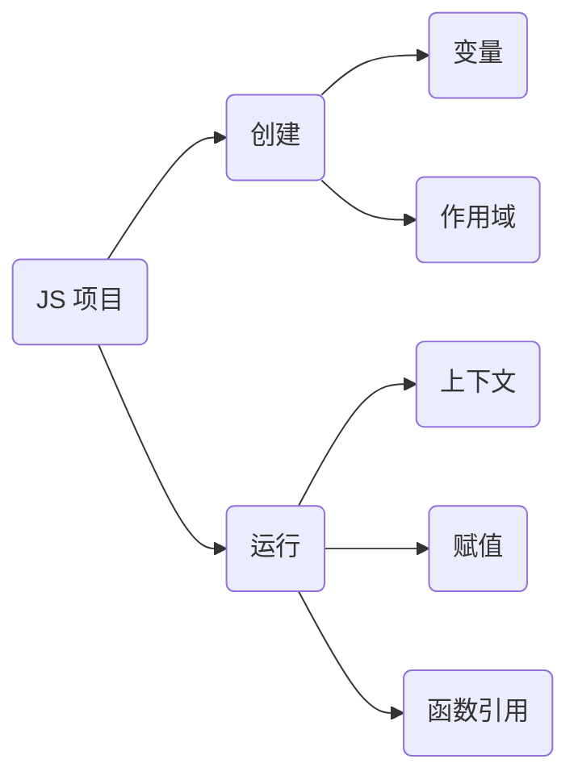

> [!TIP] 
> -  **JS 文件在运行时分为两种状态：运行态、执行态**
> -  **执行过程由上至下** 
>  




## 作用域链

例：
```javascript
let a = 'global'

function course() {
	let b = 'zhaowa'

	// 函数的静态提升
	session()
	function session() {
		let c = 'session'
	
		teach()
		function teach() {
			let d = 'cc'

			// 执行函数 链式调用，一层层向外找，找到 b
			console.log(d,b) // cc zhaowa
		}
	}
	
	// 变量的近态提升： console.log(n1)
	//               var n1 = 'n1'
	// 结果为 undefined（虽然变量被提升上去了，但是没有赋值，赋值在执行阶段）
	
	// 1. 提升优先级 => 函数需要变量
	// 提升维度：变量优先函数
	// 执行维度：函数优先变量，即函数先执行
	
	// 2. 函数 是天然的隔离方案（作用域）
	// 将执行链 分为一环又一环：course/session/teach

	// 3. 块级作用域
	// 逻辑判断不需要函数包裹，函数会占用一个独立执行空间，造成资源上的浪费。
	// 逻辑块（独立作用域）内部的变量在不使用后会被立刻释放，节约变量。
	// es6 块级作用域 性能优化
	
	if (val = true) {
		let el = "el";
		var foo = "foo"
	}
	console.log(el, foo)// Uncaught ReferenceError: el is not defined
	// 块级作用域中 let 声明的变量 el 外部无法拿到
}

course()
```

总结：
1. 对于作用域链我们直接通过创建态来定位作用域链中的某一环
2. 想手动取消链条环甚至全局作用域的话，可以利用块级作用域

## This  &  content

判断参照物
- This 是在执行时动态读取上下文决定的
- 各个使用情况下 this 的指向

### 1 函数直接调用：this 指向 window

例：
```javascript
	function foo() { 
		console.log("函数内部 this", this) // window 对象 
	} 
	
	foo()
```

### 2 隐式绑定：this 指向调用堆栈的上一级

例：
```javascript
	function fn() {
		console.log("隐式绑定 this", this.a)
	}
	
	const bar = {
		a: 'a',
		fn
	}
	
	bar.fn = fn // 赋值操作，bar.fn 此时 fn 有了上一层 bar，this 指向 bar 
	bar.fn() // a
```

### 面试题
[[This & content — 面试题]]

## 显式绑定（  bind  |  call  |  apply  ）

例：
```javascript
	function foo() {
		console.log("函数 this", this)
	}
	
	foo() // '函数 this' window 对象
	
	// 绑定并执行
	foo.call({ a: 1 }) // '函数 this' { a: 1 }
	foo.apply({ b: 2 }) // '函数 this' { b: 2 }
	
	// 绑定、不执行，返函数，需要手动执行
	const bFoo = foo.bind({ c: 3 })
	bFoo() // '函数 this' { c: 3 }
```

> [!question] call 和 apply 有什么区别？
> 	call 和 apply 本质没什么区别

> [!example]+ 传参区别，多个参数：
> 1. call 依次传入 ⇒ `foo.call({ a: 1 }, b, c, d…)`
> >
> 2. apply 传入一个数组 ⇒ `foo.apply({ a: 1 }, [b, c, d])`

### 面试题
[[显式绑定 — 面试题]]

## New 关键字

例：
```js
	class Course {
		constructor(name) {
			this.name = name
			console.log('in constructor', this)
		}
		

		test() {
			console.log('test', this)
		}

		asyncTest() {
			setTimeout(function() { // 内部 this 指向 window
				console.log('async', this)
			}, 300)
		}
	}

	// 实例化，调用 constructor
	const course = new Course('math') // in constructor，Course 实例

	course.test() // test，Course 实例
	course.asyncTest() // async，window 对象
```

> [!question] asyncTest 内部 this 如何指向实例？
> >
> ```js
>  asyncTest() {
> 	let  _this = this
> 	setTimeout(function() {
> 		console.log('async', _this)
> 	}, 300)
>  } 
> ```

## 闭包：突破作用域

>[!info] 特征：是否使用局部变量
> 	打破作用域，局部作用域内的内容通过函数传递出去，使外部读取到函数内部的变量

例：
```js
	function mail() {
		let content = "content"
		return function() {
			console.log(content)
		}
	}

	const envlop = mail()
	envlop() // content
```
